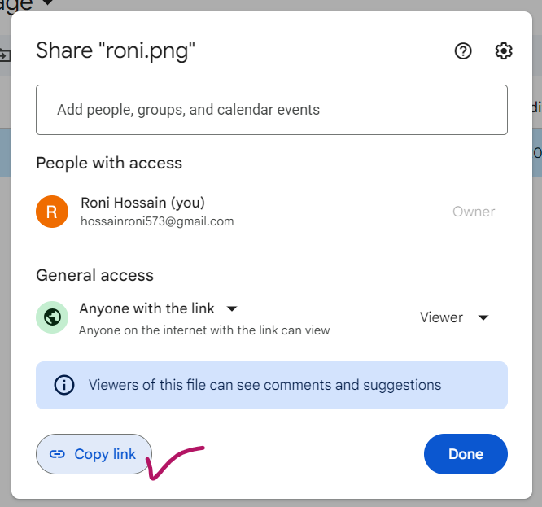
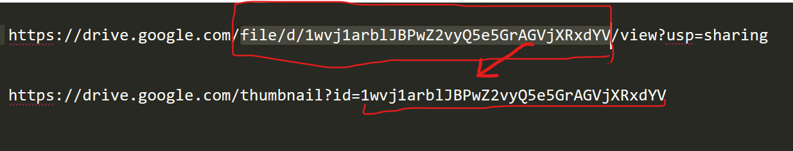

- Why Embeding Need?
    - Sometimes google drive image don't show as preview in website. Embeding easily solve this problem. Let's begin
    - First Get the image Link from google drive
    -  
    - After copy the Link Get the Id from Link, For Example:
    Link:
    ```
    https://drive.google.com/file/d/1wvj1arblJBPwZ2vyQ5e5GrAGVjXRxdYV/view?usp=sharing
    ```
    - Modify This Link like following:
    - 
    - Then use modified Link
    - Okk.......